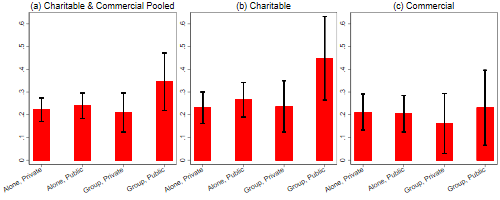
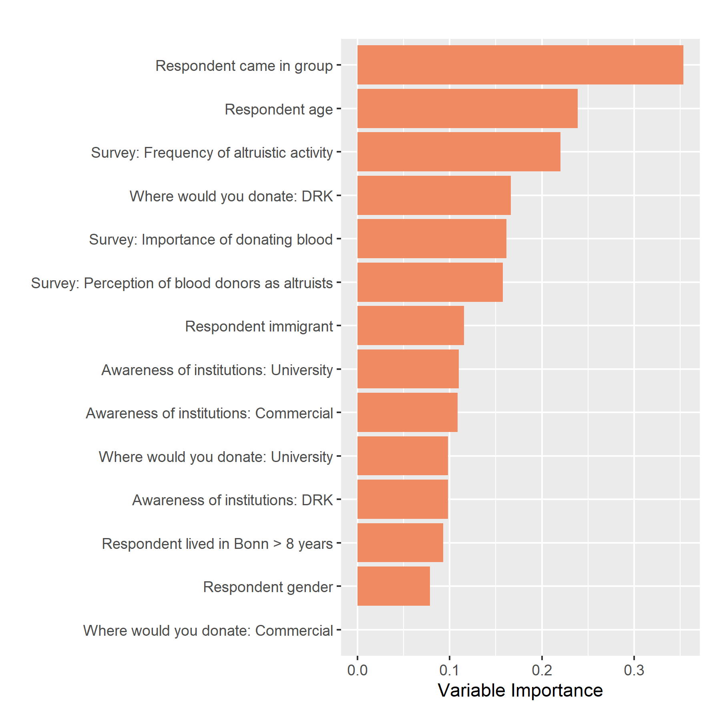

  Replication of results for ''Image Concerns in Pledges to Give Blood: Evidence from a Field Experiment''
=======

Christian Johannes Meyer and Egon Tripodi   

__TABLE 1__

          . use "${data_in}/main.dta", clear

          . do "${dopath}/Table 1.do" 

          . preserve

          .         qui drop if donation_treatment==2

          .         qui putexcel set "${out}/Table_1.xlsx", modify sheet("balancetable_cond_wo_choose",replace)

          .         qui putexcel A1 = ("Summary Statistics of Variables in Bonn City Hall Experiment, by Treatment Assignment") ///
                           A2 = ("Means and Standard Errors")

          .         qui putexcel B4 = ("Full sample") C4 = ("Not paid, Private") D4 = ("Paid, Private ") ///
                           E4 = ("Not paid, Public") F4 = ("Paid, Public") G4 = ("F-test p-value") H4 = ("Kruskal-Wallis p-value")

          .         qui loc i = 6 // First row where we start to write into Excel sheet

          .         foreach v in survey1_social survey1_blooddonation survey1_othersaltruism ///
                           survey2_awarenessdeutschesrotesk survey2_wheredonate_drk survey2_awarenesshaema ///
                           survey2_wheredonate_haema survey2_awarenessuniversitätskli survey2_wheredonate_ukb ///
                           age postsurvey_gender postsurvey_group postsurvey_migration_any survey2_yearsinbonn ///
                           postsurvey_socialimage postsurvey_attention {

          .                 qui loc varlab : di `"`: var label `v''"'  
          .                 qui mean `v'
          .                 qui mat a = r(table)
          .                 qui loc fullsamplemean = a[1,1]
          .                 qui loc fullsamplese = a[2,1]
          .                 qui loc fullsamplese : di %4.3f round(`fullsamplese', 0.001)
          .                 qui mean `v', over(donation_condition)
          .                 qui mat a = r(table)
          .                 qui mat conditionmeans = a[1,1..4]
          .                 forval t = 1/7 {
          .                         qui loc se`t' = a[2,`t']
          .                         qui loc se`t' : di %4.3f round(`se`t'', 0.001)
          .                         }
          .                 qui oneway `v' donation_condition 
          .                 qui loc pval_f = Ftail(r(df_m), r(df_r), r(F)) // calculate p-value from F distr
          .                 qui kwallis `v', by(donation_condition)
          .                 qui loc pval_kw = chi2tail(r(df),r(chi2_adj))  // calculate p-value from Chi^2
          .                 qui putexcel A`i' = ("`varlab'") B`i' = (`fullsamplemean') C`i' = matrix(conditionmeans) I`i' = (`pval_f') J`i' = (`pval_kw')
          .                 qui loc ++i     // Go to next row for standard errors
          .                 qui putexcel B`i' = ("(`fullsamplese')")        C`i' = ("(`se1')")      D`i' = ("(`se2')")      ///
                                   E`i' = ("(`se3')")  F`i' = ("(`se4')")  G`i' = ("(`se5')")      H`i' = ("(`se6')")

          .                 qui loc ++i // Go to next row for next variable
          .         }

          .         qui loc ++i // Space out by one row

          .         qui tab donation_condition, matcell(a)

          .         qui loc fullsampleN=`r(N)'

          .         qui mat treatmentN=a'

          .         qui putexcel A`i' = ("N") B`i' = (`fullsampleN') C`i' = matrix(treatmentN)

          . restore

          . preserve

          .         qui import excel "${out}/Table_1.xlsx", firstrow allstring cellrange(A4:J39) clear

          .         qui drop Ftestpvalue KruskalWallispvalue

          .         qui rename I Ftestpvalue

          .         qui rename J KruskalWallispvalue

          .         qui rename A varname

          .         qui drop if _n == 1

          .         foreach x in Fullsample NotpaidPrivate PaidPrivate NotpaidPublic PaidPublic ///
                           Ftestpvalue KruskalWallispvalue{

          .                 qui gen temp = strpos( `x', ")")
          .                 qui gen first_dot = strpos(`x', ".")
          .                 qui replace `x' = substr(`x', 1, 6) if temp == 0 & first_dot == 3
          .                 qui replace `x' = substr(`x', 1, 5) if temp == 0 & first_dot == 2
          .                 qui replace `x' = string(0) + substr(`x', 1, 4) if temp == 0 & first_dot == 1
          .                 qui drop temp first_dot
          .         }

          .         drop Ftestpvalue

          .         qui replace varname = subinstr(varname, " (5 point likert scale)", " ", 1)

          .         di as res "################################### TABLE 1 ###################################"
          ################################### TABLE 1 ###################################

          .         list, sep(100) ab(8)

               +------------------------------------------------------------------------------------------------------------+
               |                                  varname   Fullsa~e   Notpai~e   PaidPr~e   Notpai~c   PaidPu~c   Kruska~e |
               |------------------------------------------------------------------------------------------------------------|
            1. |        Frequency of altruistic activity       3.058      3.085      3.066      3.019      3.056      0.921 |
            2. |                                             (0.037)    (0.064)    (0.076)    (0.078)    (0.082)            |
            3. |            Importance of donating blood       4.006      4.030      3.881      3.955      4.169      0.088 |
            4. |                                             (0.043)    (0.076)    (0.095)    (0.083)    (0.093)            |
            5. | Perception of blood donors as altruists       4.153      4.156      4.074      4.242      4.120      0.550 |
            6. |                                             (0.036)    (0.064)    (0.082)    (0.065)    (0.081)            |
            7. |           Awareness of institutions: DRK      0.855      0.833      0.814      0.891      0.887      0.155 |
            8. |                                             (0.014)    (0.027)    (0.034)    (0.025)    (0.029)            |
            9. |        Where would you go to donate: DRK      0.412      0.409      0.422      0.426      0.387      0.913 |
           10. |                                             (0.020)    (0.035)    (0.043)    (0.040)    (0.044)            |
           11. |         Awareness of institutions: Haema      0.131      0.156      0.185      0.089      0.088      0.030 |
           12. |                                             (0.014)    (0.026)    (0.034)    (0.023)    (0.026)            |
           13. |      Where would you go to donate: Haema      0.029      0.030      0.044          0      0.048      0.059 |
           14. |                                             (0.007)    (0.012)    (0.018)    (0.000)    (0.019)            |
           15. |           Awareness of institutions: UKB      0.705      0.666      0.740      0.751      0.669      0.201 |
           16. |                                             (0.018)    (0.034)    (0.038)    (0.035)    (0.042)            |
           17. |        Where would you go to donate: UKB      0.558      0.560      0.533      0.573      0.564      0.917 |
           18. |                                             (0.020)    (0.035)    (0.043)    (0.040)    (0.045)            |
           19. |                           Respondent age     34.415     33.555     35.807     34.312     34.403      0.359 |
           20. |                                             (0.480)    (0.827)    (1.034)    (0.966)    (1.075)            |
           21. |                        Respondent gender      0.488      0.424      0.518      0.458      0.596      0.017 |
           22. |                                             (0.020)    (0.035)    (0.043)    (0.040)    (0.044)            |
           23. |                 Respondent came in group      0.299      0.363      0.303      0.254       0.25      0.205 |
           24. |                                             (0.026)    (0.049)    (0.056)    (0.051)    (0.047)            |
           25. |                Respondent migrant status      0.130      0.131      0.125      0.127      0.137      0.993 |
           26. |                                             (0.014)    (0.024)    (0.029)    (0.027)    (0.031)            |
           27. |           Respondent years lived in Bonn      5.666      5.656      5.688      5.675      5.645      0.991 |
           28. |                                             (0.150)    (0.268)    (0.327)    (0.291)    (0.327)            |
           29. |       Intensity of social image concern       3.438      3.212      3.488      3.617      3.516      0.004 |
           30. |                                             (0.045)    (0.081)    (0.097)    (0.085)    (0.101)            |
           31. |    Attention/ability to complete survey       4.202      4.141      4.348      4.128      4.241      0.008 |
           32. |                                             (0.029)    (0.052)    (0.061)    (0.049)    (0.071)            |
           33. |                                                                                                            |
           34. |                                        N        614        198        135        157        124            |
               +------------------------------------------------------------------------------------------------------------+

          . restore

__TABLE 2__

          . use "${data_in}/main.dta", clear

          . do "${dopath}/Table 2.do" 

          . qui global controls_all "i.survey1_social i.survey1_blooddonation i.survey1_othersaltruism survey2_awarenessdeutschesrotesk survey2_awarenesshaema survey2_awarenessuniversitätskli i.age_group i.postsurvey_gender i.postsurvey_migration_any survey2_yearsinbonn survey2_wheredonate_drk survey2_wheredonate_haema survey2_wheredonate_ukb"

          . qui lasso2 donation_willing $controls_all, postresults 

          . qui lasso2, lic(aic) postresults 

          . qui gl lassochosen_y=e(selected)

          . if "$lassochosen_y"=="." { 
          .         qui gl lassochosen_y 
          .                 }

          . qui lasso2 socialimage $controls_all, postresults 

          . qui lasso2, lic(aic) postresults 

          . qui gl lassochosen_v=e(selected)

          . if "$lassochosen_v"=="." { 
          .         qui gl lassochosen_v 
          .                 }

          . qui lasso2 donation_treatment $controls_all, postresults 

          . qui lasso2, lic(aic) postresults 

          . qui gl lassochosen_t=e(selected)

          . if "$lassochosen_t"=="." { 
          .         qui gl lassochosen_t 
          .                 }

          . qui eststo m0: reg donation_willing i.socialimage, vce(robust)

          . qui eststo m2: reg donation_willing i.socialimage $lassochosen_y ///
                   $lassochosen_v $lassochosen_t, vce(robust)

          . qui eststo m3: reg donation_willing i.socialimage##i.donation_treatment, vce(robust)

          . qui eststo m5: reg donation_willing i.socialimage##i.donation_treatment ///
                   $lassochosen_y $lassochosen_v $lassochosen_t, vce(robust)

          . qui esttab m0 m2 m3 m5 using "${out}/Table_2.tex", keep(1.socialimage* 1.donation_treatment* _cons) ///
                   b(3) se(3) stats( N r2, fmt(%6.0g) labels("Observations" "\(R^{2}\)")) replace

          . di as res "################################## TABLE 2 ##################################"
          ################################## TABLE 2 ##################################

          . estout m0 m2 m3 m5, keep(1.socialimage* 1.donation_treatment* _cons) ///
                   stats( N r2, fmt(%6.0g) labels("Observations" "R2")) ///
                   ce(b(fmt(3) label("Coef")) se(par fmt(3))) nobaselevel title("TABLE 2")

          TABLE 2
          ----------------------------------------------------------------
                                 m0           m2           m3           m5
                            Coef/se      Coef/se      Coef/se      Coef/se
          ----------------------------------------------------------------
          1.socialim~e        0.041        0.044        0.067        0.080
                            (0.035)      (0.034)      (0.047)      (0.046)
          1.donation~t                                 -0.032       -0.017
                                                      (0.046)      (0.045)
          1.socialim~t                                 -0.057       -0.080
                                                      (0.069)      (0.069)
          _cons               0.219        0.164        0.232        0.167
                            (0.023)      (0.070)      (0.030)      (0.072)
          ----------------------------------------------------------------
          Observations          614          614          614          614
          R2                  .0023        .0835         .008        .0894
          ----------------------------------------------------------------

          . mean donation_willing if socialimage==0 //cols 1-2

          Mean estimation                                Number of obs = 333

          ------------------------------------------------------------------
                           |       Mean   Std. err.     [95% conf. interval]
          -----------------+------------------------------------------------
          donation_willing |   .2192192   .0227057       .174554    .2638844
          ------------------------------------------------------------------

          . mean donation_willing if socialimage==0 & donation_treatment==0 //cols 3-4

          Mean estimation                                Number of obs = 198

          ------------------------------------------------------------------
                           |       Mean   Std. err.     [95% conf. interval]
          -----------------+------------------------------------------------
          donation_willing |   .2323232   .0300886      .1729861    .2916604
          ------------------------------------------------------------------

__FIGURE 1__

          . use "${data_in}/main.dta", clear

          . do "${dopath}/Figure 1.do"

          . qui gen socialimageandgroup=1

          . qui replace socialimageandgroup = 2 if socialimage ==1 & groupdummy==0

          . qui replace socialimageandgroup = 3 if socialimage ==0 & groupdummy==1

          . qui replace socialimageandgroup = 4 if socialimage ==1 & groupdummy==1

          . qui la define socialimageandgroup 1 "Alone, Private" 2 "Alone, Public" 3 "Group, Private" 4 "Group, Public"

          . qui la val socialimageandgroup socialimageandgroup

          . qui by socialimageandgroup,sort: egen pledging_rate_any=mean(donation_willing)

          . qui by socialimageandgroup,sort: egen pledging_rate_count=count(donation_willing)

          . qui by socialimageandgroup,sort: egen pledging_rate_sd=sd(donation_willing)

          . qui gen pledging_rate_semean = pledging_rate_sd/sqrt(pledging_rate_count)

          . qui gen ul_any = pledging_rate_any + 1.96*pledging_rate_semean

          . qui gen ll_any = pledging_rate_any - 1.96*pledging_rate_semean

          . qui drop pledging_rate_count pledging_rate_sd pledging_rate_semean

          . qui by socialimageandgroup donation_treatment,sort: egen pledging_rate=mean(donation_willing)

          . qui by socialimageandgroup donation_treatment,sort: egen pledging_rate_count=count(donation_willing)

          . qui by socialimageandgroup donation_treatment,sort: egen pledging_rate_sd=sd(donation_willing)

          . qui gen pledging_rate_semean = pledging_rate_sd/sqrt(pledging_rate_count)

          . qui gen ul = pledging_rate + 1.96*pledging_rate_semean

          . qui gen ll = pledging_rate - 1.96*pledging_rate_semean

          . qui twoway (bar pledging_rate_any socialimageandgroup, color(red) fintensity(inten100) ///
                   barw(0.4) ytitle("") xtitle("") title("(a) Charitable & Commercial Pooled", color(black)) ///
                   ylabel(0(0.10)0.6, labsize(medium)) xlabel(,valuelabel labsize(medium) angle(30))) ///
                   (rcap ll_any ul_any socialimageandgroup, color(black)), ///
                   graphregion(color(white)) graphregion(margin(0 0 0 0)) legend(off) name(graph0,replace)

          . qui twoway (bar pledging_rate socialimageandgroup if donation_treatment==0, color(red) ///
                   fintensity(inten100) barw(0.4) ytitle("") xtitle("") title("(b) Charitable", color(black)) ///
                   ylabel(0(0.10)0.6, labsize(medium)) xlabel(,valuelabel labsize(medium) angle(30))) ///
                   (rcap ll ul socialimageandgroup if donation_treatment==0, color(black)), ///
                   graphregion(color(white)) graphregion(margin(0 0 0 0)) legend(off) name(graph1,replace)

          . qui twoway (bar pledging_rate socialimageandgroup if donation_treatment==1, color(red) ///
                   fintensity(inten100) barw(0.4) ytitle("") xtitle("") title("(c) Commercial", color(black)) ///
                   ylabel(0(0.10)0.6, labsize(medium)) xlabel(,valuelabel labsize(medium) angle(30))) ///
                   (rcap ll ul socialimageandgroup if donation_treatment==1, color(black)), ///
                   graphregion(color(white)) graphregion(margin(0 0 0 0)) legend(off) name(graph2,replace)

          . qui graph combine graph0 graph1 graph2, graphregion(color(white)) ///
                   graphregion(margin(8 1 0 0)) ysize(2) xsize(5) ycommon row(1) scale(1.3)

          . qui graph export "${out}/Figure_1.png", replace width(500)

__TABLE 3__

          . use "${data_in}/main.dta", clear

          . do "${dopath}/Table 3.do" 

          . qui global controls_all "i.survey1_social i.survey1_blooddonation i.survey1_othersaltruism survey2_awarenessdeutschesrotesk survey2_awarenesshaema survey2_awarenessuniversitätskli i.age_group i.postsurvey_gender i.postsurvey_migration_any survey2_yearsinbonn survey2_wheredonate_drk survey2_wheredonate_haema survey2_wheredonate_ukb"

          . qui lasso2 donation_willing $controls_all, postresults 

          . qui lasso2, lic(aic) postresults 

          . qui gl lassochosen_y=e(selected)

          . if "$lassochosen_y"=="." { 
          .         qui gl lassochosen_y 
          .                 }

          . qui lasso2 socialimage $controls_all, postresults 

          . qui lasso2, lic(aic) postresults 

          . qui gl lassochosen_v=e(selected)

          . if "$lassochosen_v"=="." { 
          .         qui gl lassochosen_v 
          .                 }

          . qui lasso2 donation_treatment $controls_all, postresults 

          . qui lasso2, lic(aic) postresults 

          . qui gl lassochosen_t=e(selected)

          . if "$lassochosen_t"=="." { 
          .         qui gl lassochosen_t 
          .                 }

          . qui lasso2 groupdummy $controls_all if donation_treatment==1, postresults 

          . qui lasso2, lic(aic) postresults 

          . qui gl lassochosen_g=e(selected)

          . if "$lassochosen_g"=="." { 
          .         qui gl lassochosen_g 
          . }

          . qui eststo m1: reg donation_willing i.visibility_composition, vce(robust)

          . qui lincom (4.visibility_composition-2.visibility_composition)- ///
                   (3.visibility_composition-1.visibility_composition)

          . qui loc c_m1 : di %4.3f round(r(estimate), 0.001)

          . qui loc p_m1 : di %4.3f round(r(p), 0.001)

          . qui eststo m2: reg donation_willing i.visibility_composition $lassochosen_y ///
                   $lassochosen_v $lassochosen_t $lassochosen_g , vce(robust)

          . qui lincom (4.visibility_composition-2.visibility_composition)- ///
                   (3.visibility_composition-1.visibility_composition)

          . qui loc c_m2 : di %4.3f round(r(estimate), 0.001)

          . qui loc p_m2 : di %4.3f round(r(p), 0.001)

          . qui eststo m3: reg donation_willing i.visibility_composition $lassochosen_y ///
                   $lassochosen_v $lassochosen_t $lassochosen_g postsurvey_socialimage, vce(robust)

          . qui lincom (4.visibility_composition-2.visibility_composition)- ///
                   (3.visibility_composition-1.visibility_composition)

          . qui loc c_m3 : di %4.3f round(r(estimate), 0.001)

          . qui loc p_m3 : di %4.3f round(r(p), 0.001)

          . qui lasso2 donation_willing $controls_all if donation_treatment==0, postresults 

          . qui lasso2, lic(aic) postresults 

          . qui gl lassochosen_y=e(selected)

          . if "$lassochosen_y"=="." { 
          .         qui gl lassochosen_y 
          .                 }

          . qui lasso2 socialimage $controls_all if donation_treatment==0, postresults 

          . qui lasso2, lic(aic) postresults 

          . qui gl lassochosen_v=e(selected)

          . if "$lassochosen_v"=="." { 
          .         qui gl lassochosen_v 
          .                 }

          . qui lasso2 groupdummy $controls_all if donation_treatment==0, postresults 

          . qui lasso2, lic(aic) postresults 

          . qui gl lassochosen_g=e(selected)

          . if "$lassochosen_g"=="." { 
          .         qui gl lassochosen_g            
          . }

          . qui eststo m4: reg donation_willing i.visibility_composition if donation_treatment==0, vce(robust)

          . qui lincom (4.visibility_composition-2.visibility_composition)- ///
                   (3.visibility_composition-1.visibility_composition)

          . qui loc c_m4 : di %4.3f round(r(estimate), 0.001)

          . qui loc p_m4 : di %4.3f round(r(p), 0.001)      

          . qui eststo m5: reg donation_willing i.visibility_composition $lassochosen_y ///
                   $lassochosen_v $lassochosen_g if donation_treatment==0, vce(robust)

          . qui lincom (4.visibility_composition-2.visibility_composition)- ///
                   (3.visibility_composition-1.visibility_composition)

          . qui loc c_m5 : di %4.3f round(r(estimate), 0.001)

          . qui loc p_m5 : di %4.3f round(r(p), 0.001)

          . qui eststo m6: reg donation_willing i.visibility_composition $lassochosen_y ///
                   $lassochosen_v $lassochosen_g postsurvey_socialimage if donation_treatment==0, vce(robust)

          . qui lincom (4.visibility_composition-2.visibility_composition)- ///
                   (3.visibility_composition-1.visibility_composition)

          . qui loc c_m6 : di %4.3f round(r(estimate), 0.001)

          . qui loc p_m6 : di %4.3f round(r(p), 0.001)

          . qui lasso2 donation_willing $controls_all if donation_treatment==1, postresults 

          . qui lasso2, lic(aic) postresults 

          . qui gl lassochosen_y=e(selected)

          . if "$lassochosen_y"=="." { 
          .         qui gl lassochosen_y 
          .                 }

          . qui lasso2 socialimage $controls_all if donation_treatment==1, postresults 

          . qui lasso2, lic(aic) postresults 

          . qui gl lassochosen_v=e(selected)

          . if "$lassochosen_v"=="." { 
          .         qui gl lassochosen_v 
          .                 }

          . qui lasso2 groupdummy $controls_all if donation_treatment==1, postresults 

          . qui lasso2, lic(aic) postresults 

          . qui gl lassochosen_g=e(selected)

          . if "$lassochosen_g"=="." { 
          .         qui gl lassochosen_g 
          .                 }

          . qui eststo m7: reg donation_willing i.visibility_composition if donation_treatment==1, vce(robust)

          . qui lincom (4.visibility_composition-2.visibility_composition)- ///
                   (3.visibility_composition-1.visibility_composition)

          . qui loc c_m7 : di %4.3f round(r(estimate), 0.001)

          . qui loc p_m7 : di %4.3f round(r(p), 0.001)

          . qui eststo m8: reg donation_willing i.visibility_composition $lassochosen_y ///
                   $lassochosen_v $lassochosen_g if donation_treatment==1, vce(robust)

          . qui lincom (4.visibility_composition-2.visibility_composition)- ///
                   (3.visibility_composition-1.visibility_composition)

          . qui loc c_m8 : di %4.3f round(r(estimate), 0.001)

          . qui loc p_m8 : di %4.3f round(r(p), 0.001)

          . qui eststo m9: reg donation_willing i.visibility_composition $lassochosen_y ///
                   $lassochosen_v $lassochosen_g postsurvey_socialimage if donation_treatment==1, vce(robust)

          . qui lincom (4.visibility_composition-2.visibility_composition)- ///
                   (3.visibility_composition-1.visibility_composition)

          . qui loc c_m9 : di %4.3f round(r(estimate), 0.001)

          . qui loc p_m9 : di %4.3f round(r(p), 0.001)

          . qui esttab m1 m2 m3 m4 m5 m6 m7 m8 m9 using "${out}/Table_3.tex", keep(*visibility_composition _cons) ///
                   b(3) se(3) stats(N r2, fmt(%6.0g) labels("Observations" "\(R^{2}\)")) replace

          . di as res "################################## TABLE 3 ##################################"
          ################################## TABLE 3 ##################################

          . estout m1 m2 m3 m4 m5 m6 m7 m8 m9, keep(*visibility_composition _cons) ///
                   stats( N r2, fmt(%6.0g) labels("Observations" "R2")) ///
                   ce(b(fmt(3) label("Coef")) se(par fmt(3))) nobaselevel title("TABLE 3")

          TABLE 3
          ---------------------------------------------------------------------------------------------------------------------------------
                                 m1           m2           m3           m4           m5           m6           m7           m8           m9
                            Coef/se      Coef/se      Coef/se      Coef/se      Coef/se      Coef/se      Coef/se      Coef/se      Coef/se
          ---------------------------------------------------------------------------------------------------------------------------------
          2.visibili~n       -0.013       -0.051       -0.053        0.006       -0.039       -0.045       -0.050       -0.064       -0.064
                            (0.051)      (0.051)      (0.051)      (0.068)      (0.068)      (0.068)      (0.078)      (0.079)      (0.079)
          3.visibili~n        0.016        0.008        0.002        0.035        0.015       -0.001       -0.007       -0.028       -0.028
                            (0.039)      (0.039)      (0.039)      (0.053)      (0.053)      (0.055)      (0.058)      (0.058)      (0.058)
          4.visibili~n        0.123        0.125        0.121        0.218        0.197        0.183        0.019        0.024        0.024
                            (0.070)      (0.065)      (0.065)      (0.099)      (0.090)      (0.089)      (0.093)      (0.091)      (0.091)
          _cons               0.223        0.174        0.101        0.231        0.153        0.038        0.212        0.171        0.158
                            (0.027)      (0.071)      (0.085)      (0.035)      (0.092)      (0.119)      (0.040)      (0.119)      (0.145)
          ---------------------------------------------------------------------------------------------------------------------------------
          Observations          614          614          614          355          355          355          259          259          259
          R2                  .0069        .0902        .0933        .0172        .1216        .1283        .0019        .1302        .1303
          ---------------------------------------------------------------------------------------------------------------------------------

          . preserve

          .         qui clear

          .         qui set obs 2

          .         qui gen varname = ""

          .         qui replace varname = "Public: Group - Alone" in 1

          .         qui replace varname = "(p-value)" in 2

          .         forval col = 1/9{
          .                 qui gen m`col' = ""
          .         }

          .         forval col = 1/9{
          .                 qui replace m`col' = "`c_m`col''" in 1
          .                 qui replace m`col' = "`p_m`col''" in 2
          .         }

          .         list, sep(100)

               +-----------------------------------------------------------------------------------------------+
               |               varname      m1      m2      m3      m4      m5      m6      m7      m8      m9 |
               |-----------------------------------------------------------------------------------------------|
            1. | Public: Group - Alone   0.120   0.168   0.171   0.177   0.220   0.229   0.077   0.116   0.116 |
            2. |             (p-value)   0.169   0.042   0.037   0.146   0.049   0.041   0.526   0.331   0.331 |
               +-----------------------------------------------------------------------------------------------+

          . restore

__TABLE 4__

          . use "${data_in}/data_table_4.dta", clear

          . do "${dopath}/Table 4.do" 

          . cls

          . des, s

          Contains data from C:\Users\giaco\Dropbox\EUI Blood/data/field/data_in/data_table_4.dta
           Observations:           614                  
              Variables:             5                  29 Apr 2021 17:55
          Sorted by: 

          . gen matched = (!missing(donated_during_study_period))

          . mat input rows_to_fill = (2, 3, 4, 7, 8, 9, 10)

          . loc row_to_pick = 1

          . foreach command in ///
                   "tab donation_treatment socialimage, matcell(A)" ///
                   "tab donation_treatment socialimage if matched == 1, matcell(A)" ///
                   "tab donation_treatment socialimage if already_donor != 0, matcell(A)" ///
                   "tab donation_treatment socialimage if donation_willing == 1 & matched == 1, matcell(A)" ///
                   "tab donation_treatment socialimage if donation_willing == 1 & matched == 1 & donated_during_study_period, matcell(A)" ///
                   "tab donation_treatment socialimage if donation_willing == 0 & matched == 1, matcell(A)" ///
                   "tab donation_treatment socialimage if donation_willing == 0 & matched == 1 & donated_during_study_period == 1, matcell(A)"{

          .         qui `command' // execute the command
          .         loc row = rows_to_fill[1, `row_to_pick'] // pick the row of the tbl from the row to be used
          .         mat v = J(1, 5, .) // empty vector, to fill later with the row values
          .         mat v[1, 1] = r(N) // obs number, always in first col, so first element of vector
          .         loc j = 2
          .         forval r = 1/2{ // this double loop fill the position 2-4 of vector v
          .                 forval c = 1/2{
          .                         mat v[1, `j'] = A[`r', `c'] // here it is
          .                         loc j = `j' + 1
          .                 }
          .         }
          .         forval c = 1/5{
          .                 loc t`row'`c' = v[1, `c'] // define the element ij of the table, picking from the vector
          .         }
          .         loc row_to_pick = `row_to_pick' + 1 // update to pick the next row in the next loop
          . }

          . drop matched

          . preserve

          .         clear

          .         set obs 10
          Number of observations (_N) was 0, now 10.

          .         gen varname = ""
          (10 missing values generated)

          .         forval col = 1/5{
          .                 qui gen c`col' = ""
          .         }

          .         qui loc j = 1

          .         foreach row in ///
                           "a) Name matching and donor status of study subjects" ///
                           "All Participants" ///
                           "Matched with donor databases" ///
                           "Previously donated with either blood collector" ///
                           "b) Pledges and donations" ///
                           "Pledged a donation in study" ///
                           "of which donated" ///
                           "Did not pledge a donation in study" ///
                           "of which donated"{

          .                 qui replace varname = "`row'" in `j'
          .                 qui loc j = `j' + 1
          .                 if "`row'" == "Previously donated with either blood collector"{
          .                         qui loc j = `j' + 1
          .                 }
          .         }

          .         forval row = 1/10{
          .                 forval col = 1/5{
          .                         qui replace c`col' = "`t`row'`col''" in `row'
          .                         if "`t`row'`col''" == "."{
          .                                 qui replace c`col' = "0" in `row'
          .                         }
          .                 }
          .         }

          .         qui loc j = 1

          .         foreach col in whole_sample char_priv char_publ comm_priv comm_publ{
          .                 qui rename c`j' `col'
          .                 qui loc j = `j' + 1
          .         }

          .         di as res "################################### TABLE 4 ###################################"
          ################################### TABLE 4 ###################################

          .         list, sep(100) abb(15)

               +--------------------------------------------------------------------------------------------------------------------+
               |                                             varname   whole_sample   char_priv   char_publ   comm_priv   comm_publ |
               |--------------------------------------------------------------------------------------------------------------------|
            1. | a) Name matching and donor status of study subjects                                                                |
            2. |                                    All Participants            614         198         157         135         124 |
            3. |                        Matched with donor databases            596         193         151         131         121 |
            4. |      Previously donated with either blood collector             65          18          16          14          17 |
            5. |                                                                                                                    |
            6. |                            b) Pledges and donations                                                                |
            7. |                         Pledged a donation in study            141          44          45          26          26 |
            8. |                                    of which donated              1           1           0           0           0 |
            9. |                  Did not pledge a donation in study            455         149         106         105          95 |
           10. |                                    of which donated              4           3           0           0           1 |
               +--------------------------------------------------------------------------------------------------------------------+

          . restore

__FIGURE B1__

          . use "${data_in}/main.dta", clear

          . rename survey2_awarenessuniversitätskli survey2_awarenessuniversitatskli

          . save "${data_rep}/tempfile_for_R.dta", replace
          (file C:\Users\giaco\Dropbox\EUI Blood/data/field/processing/replication_package/data/tempfile_for_R.dta not found)
          file C:\Users\giaco\Dropbox\EUI Blood/data/field/processing/replication_package/data/tempfile_for_R.dta saved

          . do "${dopath}/Figure B1.do"

          . rsource, terminator(END_OF_R) rpath(`"C:\Program Files\R\R-4.1.0\bin\x64\Rterm.exe"') roptions(`"--vanilla"')  // use this line instead if you run a windows box
          Assumed R program path: "C:\Program Files\R\R-4.1.0\bin\x64\Rterm.exe"
          Beginning of R output

          R version 4.1.0 (2021-05-18) -- "Camp Pontanezen"
          Copyright (C) 2021 The R Foundation for Statistical Computing
          Platform: x86_64-w64-mingw32/x64 (64-bit)

          R is free software and comes with ABSOLUTELY NO WARRANTY.
          You are welcome to redistribute it under certain conditions.
          Type 'license()' or 'licence()' for distribution details.

            Natural language support but running in an English locale

          R is a collaborative project with many contributors.
          Type 'contributors()' for more information and
          'citation()' on how to cite R or R packages in publications.

          Type 'demo()' for some demos, 'help()' for on-line help, or
          'help.start()' for an HTML browser interface to help.
          Type 'q()' to quit R.

library(grf)
library(foreign)
library(tidyverse)
library(rlang)
library(haven)
library(xtable)
library(cowplot)
library(DiagrammeR)
library(magrittr)
library(dplyr)

select <- dplyr::select

set.seed(1507)

df <- read_dta("C:/Users/giaco/Dropbox/EUI Blood/data/field/processing/replication_package/data/tempfile_for_R.dta")

Y <-  df$donation_willing

W <- df$publicimagecondition

Y <- Y %>%
          +   zap_formats() %>%
          +   zap_label()W <- W %>%
          +   zap_formats() %>%
          +   zap_label()X <- df %>%
          +   select(
          +     survey1_social,
          +     survey1_blooddonation,
          +     survey1_othersaltruism,
          +     survey2_awarenessdeutschesrotesk,
          +     survey2_wheredonate_drk,
          +     survey2_awarenesshaema,
          +     survey2_wheredonate_haema,
          +     survey2_awarenessuniversitatskli,
          +     survey2_wheredonate_ukb,
          +     age_group,
          +     postsurvey_gender,
          +     groupdummy,
          +     postsurvey_migration_any,
          +     longer_than_8_years
          +   )cf <- causal_forest(X,Y,W,
          +               num.trees=30000,
          +               tune.parameters = "none",
          +               honesty.fraction = 0.8,
          +               honesty.prune.leaves = FALSE,
          +               seed = 1507)imp_cf_pooled <- data.frame(variable=colnames(cf$X.orig),
          +                        importance=variable_importance(cf),
          +                        outcome="Donation sign-up",treatment="Public")imp_cf_pooled$variable[imp_cf_pooled$variable == "survey1_social"] <- "Survey: Frequency of altruistic activity"imp_cf_pooled$variable[imp_cf_pooled$variable == "survey1_blooddonation"] <- "Survey: Importance of donating blood"imp_cf_pooled$variable[imp_cf_pooled$variable == "survey1_othersaltruism"] <- "Survey: Perception of blood donors as altruists"imp_cf_pooled$variable[imp_cf_pooled$variable == "survey2_awarenessdeutschesrotesk"] <- "Awareness of institutions: DRK"imp_cf_pooled$variable[imp_cf_pooled$variable == "survey2_wheredonate_drk"] <- "Where would you donate: DRK"imp_cf_pooled$variable[imp_cf_pooled$variable == "survey2_awarenesshaema"] <- "Awareness of institutions: Commercial"imp_cf_pooled$variable[imp_cf_pooled$variable == "survey2_wheredonate_haema"] <- "Where would you donate: Commercial"imp_cf_pooled$variable[imp_cf_pooled$variable == "survey2_awarenessuniversitatskli"] <- "Awareness of institutions: University"imp_cf_pooled$variable[imp_cf_pooled$variable == "survey2_wheredonate_ukb"] <- "Where would you donate: University"imp_cf_pooled$variable[imp_cf_pooled$variable == "age_group"] <- "Respondent age"imp_cf_pooled$variable[imp_cf_pooled$variable == "postsurvey_gender"] <- "Respondent gender"imp_cf_pooled$variable[imp_cf_pooled$variable == "groupdummy"] <- "Respondent came in group"imp_cf_pooled$variable[imp_cf_pooled$variable == "postsurvey_migration_any"] <- "Respondent immigrant"imp_cf_pooled$variable[imp_cf_pooled$variable == "longer_than_8_years"] <- "Respondent lived in Bonn > 8 years"imp_cf_pooled %>%
          +   bind_rows(imp_cf_pooled) %>%
          +   ggplot(aes(x=reorder(variable,importance),
          +              y=importance,
          +              fill=outcome)) +
          +   geom_col() +
          +   coord_flip() +
          +   labs(x="") +
          +   labs(y="Variable Importance") +
          +   scale_fill_brewer(name="Outcome:",
          +                     palette = "RdBu") +
          +   ggtitle("") +
          +   theme(legend.position="none")ggsave("C:/Users/giaco/Dropbox/EUI Blood/data/field/processing/replication_package/results/Figure_B1.png", width = 15, height = 15, units = "cm")
          End of R output

          . erase "${data_rep}/tempfile_for_R.dta"

__TABLE A1__

          . use "${data_in}/data_table_a1.dta", clear

          . do "${dopath}/Table A1.do" 

          . qui clear matrix 

          . qui putexcel set "${out}/Table_A1.xlsx", replace

          . qui putexcel A1 = ("Summary Statistics of Variables in Bonn City Hall Experiment, by Participation Status") ///
                   A2 = ("Means and Standard Errors")

          . qui putexcel B4 = ("Participated") C4 = ("Aborted") D4 = ("Did not participate") ///
                   E4 = ("F-test p-value") F4 = ("Kruskal-Wallis p-value") G4 = ("Study sample")

          . qui loc i = 6 // First row where we start to write into Excel sheet

          . foreach v of varlist age_group postsurvey_gender postsurvey_migration_any ///
                   postsurvey_group postsurvey_socialimage {

          .         qui loc varlab : di `"`: var label `v''"'  
          .         qui mean `v', over(selection)
          .         qui mat a = r(table)
          .         if "`v'" == "postsurvey_socialimage" {
          .                 qui mat treatmentmeans = a[1,1..2]
          .         } 
          .         else {
          .                 qui mat treatmentmeans = a[1,1..3]
          .         }
          .         forval t = 1/3 {
          .                 qui loc se`t' = a[2,`t']
          .                 qui loc se`t' : di %4.3f `se`t''
          .                 }
          .         qui oneway `v' selection 
          .         qui loc pval_f = Ftail(r(df_m), r(df_r), r(F)) // calculate p-value from F distr
          .         qui kwallis `v', by(selection)
          .         qui loc pval_kw = chi2tail(r(df),r(chi2_adj))  // calculate p-value from Chi^2
          .         qui putexcel A`i' = ("`varlab'") B`i' = matrix(treatmentmeans) ///
                           E`i' = (`pval_f') F`i' = (`pval_kw')

          .         qui loc ++i     // Go to next row for standard errors
          .         qui putexcel B`i' = ("(`se1')") C`i' = ("(`se2')")      D`i' = ("(`se3')")
          .         qui loc ++i // Go to next row for next variable
          . }

          . loc i = 6 // First row where we start to write into Excel sheet

          . foreach v of varlist age_group postsurvey_gender postsurvey_migration_any ///
                   postsurvey_group postsurvey_socialimage {

          .         qui mean `v'
          .         qui mat a = r(table)
          .         qui loc mu : di %4.3f a[1, 1]
          .         qui loc se : di %4.3f a[2, 1]
          .         qui putexcel G`i' = ("`mu'")
          .         qui loc ++i     // Go to next row for standard errors
          .         qui putexcel G`i' = ("(`se')")
          .         qui loc ++i // Go to next row for next variable
          . }

          . loc ++i // Space out by one row

          . qui tab selection, matcell(a)

          . qui mat treatmentN=a'

          . qui putexcel A`i' = ("N") B`i' = matrix(treatmentN)

          . loc tot = _N

          . qui putexcel G`i' = ("`tot'")

          . preserve

          .         qui import excel "${out}/Table_A1.xlsx", firstrow allstring cellrange(A4:G17) clear

          .         qui rename A varname

          .         drop Ftestpvalue

          .         qui drop if inlist(_n, 1, 10, 11)

          .         foreach x in Participated Aborted Didnotparticipate KruskalWallispvalue{
          .                 qui gen temp = strpos( `x', ")")
          .                 qui gen first_dot = strpos(`x', ".")
          .                 qui replace `x' = substr(`x', 1, 6) if temp == 0 & first_dot == 3
          .                 qui replace `x' = substr(`x', 1, 5) if temp == 0 & first_dot == 2
          .                 qui replace `x' = string(0) + substr(`x', 1, 4) if temp == 0 & first_dot == 1
          .                 qui drop temp first_dot
          .         }

          .         qui gen first_one = strpos(KruskalWallispvalue, "1")

          .         replace KruskalWallispvalue = "0.000" if first_one == 1
          (2 real changes made)

          .         drop first_one

          .         qui replace varname = subinstr(varname, " (5 point likert scale)", " ", 1)

          .         order varname Studysample Participated Aborted Didnotparticipate KruskalWallispvalue

          .         di as res "################################### TABLE A1 ###################################"
          ################################### TABLE A1 ###################################

          .         list, sep(100) ab(8)

               +---------------------------------------------------------------------------------+
               |                   varname   Studys~e   Partic~d   Aborted   Didnot~e   Kruska~e |
               |---------------------------------------------------------------------------------|
            1. |      Respondent age group      3.750      3.416     4.721      3.810      0.000 |
            2. |                              (0.036)    (0.045)   (0.051)    (0.076)            |
            3. |         Respondent gender      0.519      0.488     0.520      0.587      0.027 |
            4. |                              (0.015)    (0.020)   (0.036)    (0.030)            |
            5. | Respondent migrant status      0.254      0.130     0.252      0.541      0.000 |
            6. |                              (0.013)    (0.014)   (0.031)    (0.031)            |
            7. |  Respondent came in group      0.329      0.299     0.412      0.337      0.003 |
            8. |                              (0.019)    (0.026)   (0.043)    (0.039)            |
            9. |                                                                                 |
           10. |                         N       1072        614       194        264            |
               +---------------------------------------------------------------------------------+

          . restore

__TABLE A2__

          . use "${data_in}/main.dta", clear

          . do "${dopath}/Table A2.do"

          . qui global controls_all "i.survey1_social i.survey1_blooddonation i.survey1_othersaltruism survey2_awarenessdeutschesrotesk survey2_awarenesshaema survey2_awarenessuniversitätskli i.age_group i.postsurvey_gender i.postsurvey_migration_any survey2_yearsinbonn"

          . qui lasso2 donation_willing $controls_all, postresults 

          . qui lasso2, lic(aic) postresults 

          . qui gl lassochosen_y=e(selected)

          . if "$lassochosen_y"=="." { 
          .         qui gl lassochosen_y 
          .                 }

          . qui lasso2 socialimage $controls_all, postresults 

          . qui lasso2, lic(aic) postresults 

          . qui gl lassochosen_v=e(selected)

          . if "$lassochosen_v"=="." { 
          .         qui gl lassochosen_v 
          .                 }

          . qui lasso2 donation_treatment $controls_all, postresults 

          . qui lasso2, lic(aic) postresults 

          . qui gl lassochosen_t=e(selected)

          . if "$lassochosen_t"=="." { 
          .         qui gl lassochosen_t 
          .                 }

          . qui logit donation_willing socialimage, vce(robust)

          . qui eststo m0: margins, dydx(*) post

          . qui logit donation_willing socialimage $lassochosen_y ///
                   $lassochosen_v $lassochosen_t, vce(robust)

          . qui eststo m2: margins, dydx(*) post

          . qui cap gen interaction= (socialimage==1 & donation_treatment==1)

          . qui logit donation_willing socialimage donation_treatment interaction, vce(robust) // which is identical to logit donation_willing i.socialimage##i.donation_treatment, vce(robust) -- except that we can compute marginal effects

          . qui eststo m3: margins, dydx(*) post

          . qui logit donation_willing socialimage donation_treatment interaction ///
                   $lassochosen_y $lassochosen_v $lassochosen_t, vce(robust)

          . qui eststo m5: margins , dydx(*) post

          . qui esttab m0 m2 m3 m5 using "${out}/Table_A2.tex", keep(socialimage* donation_treatment* interaction) ///
                   b(3) se(3) stats( N r2, fmt(%6.0g) labels("Observations" "\(R^{2}\)")) replace

          . di as res "################################## TABLE A2 ##################################"
          ################################## TABLE A2 ##################################

          . estout m0 m2 m3 m5, keep(socialimage* donation_treatment* interaction) ///
                   stats( N r2, fmt(%6.0g) labels("Observations" "R2")) ///
                   ce(b(fmt(3) label("Coef")) se(par fmt(3))) nobaselevel title("TABLE A2")

          TABLE A2
          ----------------------------------------------------------------
                                 m0           m2           m3           m5
                            Coef/se      Coef/se      Coef/se      Coef/se
          ----------------------------------------------------------------
          socialimage         0.040        0.042        0.062        0.073
                            (0.034)      (0.034)      (0.043)      (0.043)
          donation_t~t                                 -0.034       -0.012
                                                      (0.049)      (0.048)
          interaction                                  -0.051       -0.076
                                                      (0.070)      (0.069)
          ----------------------------------------------------------------
          Observations          614          614          614          614
          R2                                                              
          ----------------------------------------------------------------

__TABLE A3__

          . use "${data_in}/main.dta", clear

          . do "${dopath}/Table A3.do" 

          . qui global controls_all "i.survey1_social i.survey1_blooddonation i.survey1_othersaltruism survey2_awarenessdeutschesrotesk survey2_awarenesshaema survey2_awarenessuniversitätskli i.age_group i.postsurvey_gender i.postsurvey_migration_any survey2_yearsinbonn survey2_wheredonate_drk survey2_wheredonate_haema survey2_wheredonate_ukb"

          . qui lasso2 donation_willing $controls_all, postresults 

          . qui lasso2, lic(aic) postresults 

          . qui gl lassochosen_y=e(selected)

          . if "$lassochosen_y"=="." { 
          .         qui gl lassochosen_y 
          .                 }

          . qui lasso2 socialimage $controls_all, postresults 

          . qui lasso2, lic(aic) postresults 

          . qui gl lassochosen_v=e(selected)

          . if "$lassochosen_v"=="." { 
          .         qui gl lassochosen_v 
          .                 }

          . qui lasso2 donation_treatment $controls_all, postresults 

          . qui lasso2, lic(aic) postresults 

          . qui gl lassochosen_t=e(selected)

          . if "$lassochosen_t"=="." { 
          .         qui gl lassochosen_t 
          .                 }

          . qui lasso2 groupdummy $controls_all if donation_treatment==1, postresults 

          . qui lasso2, lic(aic) postresults 

          . qui gl lassochosen_g=e(selected)

          . if "$lassochosen_g"=="." { 
          .         qui gl lassochosen_g 
          . }

          . qui logit donation_willing i.visibility_composition, vce(robust)

          . qui eststo m1: margins, dydx(*) post

          . qui lincom (4.visibility_composition-2.visibility_composition)- ///
                   (3.visibility_composition-1.visibility_composition)

          . qui loc c_m1 : di %4.3f round(r(estimate), 0.001)

          . qui loc p_m1 : di %4.3f round(r(p), 0.001)

          . qui logit donation_willing i.visibility_composition $lassochosen_y ///
                   $lassochosen_v $lassochosen_t $lassochosen_g , vce(robust)

          . qui eststo m2: margins, dydx(*) post

          . qui lincom (4.visibility_composition-2.visibility_composition)- ///
                   (3.visibility_composition-1.visibility_composition)

          . qui loc c_m2 : di %4.3f round(r(estimate), 0.001)

          . qui loc p_m2 : di %4.3f round(r(p), 0.001)

          . qui logit donation_willing i.visibility_composition $lassochosen_y ///
                   $lassochosen_v $lassochosen_t $lassochosen_g postsurvey_socialimage, vce(robust)

          . qui eststo m3: margins, dydx(*) post

          . qui lincom (4.visibility_composition-2.visibility_composition)- ///
                   (3.visibility_composition-1.visibility_composition)

          . qui loc c_m3 : di %4.3f round(r(estimate), 0.001)

          . qui loc p_m3 : di %4.3f round(r(p), 0.001)

          . qui lasso2 donation_willing $controls_all if donation_treatment==0, postresults 

          . qui lasso2, lic(aic) postresults 

          . qui gl lassochosen_y=e(selected)

          . if "$lassochosen_y"=="." { 
          .         qui gl lassochosen_y 
          .                 }

          . qui lasso2 socialimage $controls_all if donation_treatment==0, postresults 

          . qui lasso2, lic(aic) postresults 

          . qui gl lassochosen_v=e(selected)

          . if "$lassochosen_v"=="." { 
          .         qui gl lassochosen_v 
          .                 }

          . qui lasso2 groupdummy $controls_all if donation_treatment==0, postresults 

          . qui lasso2, lic(aic) postresults 

          . qui gl lassochosen_g=e(selected)

          . if "$lassochosen_g"=="." { 
          .         qui gl lassochosen_g            
          . }

          . qui logit donation_willing i.visibility_composition if donation_treatment==0, vce(robust)

          . qui eststo m4: margins, dydx(*) post

          . qui lincom (4.visibility_composition-2.visibility_composition)- ///
                   (3.visibility_composition-1.visibility_composition)

          . qui loc c_m4 : di %4.3f round(r(estimate), 0.001)

          . qui loc p_m4 : di %4.3f round(r(p), 0.001)      

          . qui logit donation_willing i.visibility_composition $lassochosen_y ///
                   $lassochosen_v $lassochosen_g if donation_treatment==0, vce(robust)

          . qui eststo m5: margins, dydx(*) post

          . qui lincom (4.visibility_composition-2.visibility_composition)- ///
                   (3.visibility_composition-1.visibility_composition)

          . qui loc c_m5 : di %4.3f round(r(estimate), 0.001)

          . qui loc p_m5 : di %4.3f round(r(p), 0.001)

          . qui logit donation_willing i.visibility_composition $lassochosen_y ///
                   $lassochosen_v $lassochosen_g postsurvey_socialimage if donation_treatment==0, vce(robust)

          . qui eststo m6: margins, dydx(*) post

          . qui lincom (4.visibility_composition-2.visibility_composition)- ///
                   (3.visibility_composition-1.visibility_composition)

          . qui loc c_m6 : di %4.3f round(r(estimate), 0.001)

          . qui loc p_m6 : di %4.3f round(r(p), 0.001)

          . qui lasso2 donation_willing $controls_all if donation_treatment==1, postresults 

          . qui lasso2, lic(aic) postresults 

          . qui gl lassochosen_y=e(selected)

          . if "$lassochosen_y"=="." { 
          .         qui gl lassochosen_y 
          .                 }

          . qui lasso2 socialimage $controls_all if donation_treatment==1, postresults 

          . qui lasso2, lic(aic) postresults 

          . qui gl lassochosen_v=e(selected)

          . if "$lassochosen_v"=="." { 
          .         qui gl lassochosen_v 
          .                 }

          . qui lasso2 groupdummy $controls_all if donation_treatment==1, postresults 

          . qui lasso2, lic(aic) postresults 

          . qui gl lassochosen_g=e(selected)

          . if "$lassochosen_g"=="." { 
          .         qui gl lassochosen_g 
          .                 }

          . qui logit donation_willing i.visibility_composition if donation_treatment==1, vce(robust)

          . qui eststo m7: margins, dydx(*) post

          . qui lincom (4.visibility_composition-2.visibility_composition)- ///
                   (3.visibility_composition-1.visibility_composition)

          . qui loc c_m7 : di %4.3f round(r(estimate), 0.001)

          . qui loc p_m7 : di %4.3f round(r(p), 0.001)

          . qui logit donation_willing i.visibility_composition $lassochosen_y ///
                   $lassochosen_v $lassochosen_g if donation_treatment==1, vce(robust)

          . qui eststo m8: margins, dydx(*) post

          . qui lincom (4.visibility_composition-2.visibility_composition)- ///
                   (3.visibility_composition-1.visibility_composition)

          . qui loc c_m8 : di %4.3f round(r(estimate), 0.001)

          . qui loc p_m8 : di %4.3f round(r(p), 0.001)

          . qui logit donation_willing i.visibility_composition $lassochosen_y ///
                   $lassochosen_v $lassochosen_g postsurvey_socialimage if donation_treatment==1, vce(robust)

          . qui eststo m9: margins, dydx(*) post

          . qui lincom (4.visibility_composition-2.visibility_composition)- ///
                   (3.visibility_composition-1.visibility_composition)

          . qui loc c_m9 : di %4.3f round(r(estimate), 0.001)

          . qui loc p_m9 : di %4.3f round(r(p), 0.001)

          . qui esttab m1 m2 m3 m4 m5 m6 m7 m8 m9 using "${out}/Table_A3.tex", ///
                   keep(*visibility_composition) b(3) se(3) stats(N r2, fmt(%6.0g) labels("Observations" "\(R^{2}\)")) replace

          . di as res "################################## TABLE A3 ##################################"
          ################################## TABLE A3 ##################################

          . estout m1 m2 m3 m4 m5 m6 m7 m8 m9, keep(*visibility_composition) stats( N r2, fmt(%6.0g) ///
                           labels("Observations" "R2")) ce(b(fmt(3) label("Coef")) se(par fmt(3))) nobaselevel title("TABLE A3")

          TABLE A3
          ---------------------------------------------------------------------------------------------------------------------------------
                                 m1           m2           m3           m4           m5           m6           m7           m8           m9
                            Coef/se      Coef/se      Coef/se      Coef/se      Coef/se      Coef/se      Coef/se      Coef/se      Coef/se
          ---------------------------------------------------------------------------------------------------------------------------------
          2.visibili~n       -0.013       -0.053       -0.055        0.006       -0.056       -0.060       -0.050       -0.056       -0.056
                            (0.051)      (0.054)      (0.054)      (0.067)      (0.074)      (0.074)      (0.077)      (0.081)      (0.082)
          3.visibili~n        0.016        0.011        0.005        0.035        0.013       -0.001       -0.007       -0.023       -0.023
                            (0.039)      (0.039)      (0.039)      (0.053)      (0.052)      (0.052)      (0.057)      (0.055)      (0.055)
          4.visibili~n        0.123        0.110        0.105        0.218        0.163        0.149        0.019        0.029        0.030
                            (0.069)      (0.054)      (0.054)      (0.099)      (0.072)      (0.072)      (0.092)      (0.081)      (0.081)
          ---------------------------------------------------------------------------------------------------------------------------------
          Observations          614          614          614          355          355          355          259          259          259
          R2                                                                                                                               
          ---------------------------------------------------------------------------------------------------------------------------------

          . preserve

          .         qui clear

          .         qui set obs 2

          .         qui gen varname = ""

          .         qui replace varname = "Public: Group - Alone" in 1

          .         qui replace varname = "(p-value)" in 2

          .         forval col = 1/9{
          .                 qui gen m`col' = ""
          .         }

          .         forval col = 1/9{
          .                 qui replace m`col' = "`c_m`col''" in 1
          .                 qui replace m`col' = "`p_m`col''" in 2
          .         }

          .         list, sep(100)

               +-----------------------------------------------------------------------------------------------+
               |               varname      m1      m2      m3      m4      m5      m6      m7      m8      m9 |
               |-----------------------------------------------------------------------------------------------|
            1. | Public: Group - Alone   0.120   0.151   0.155   0.177   0.206   0.210   0.077   0.109   0.109 |
            2. |             (p-value)   0.168   0.045   0.041   0.143   0.044   0.040   0.523   0.332   0.329 |
               +-----------------------------------------------------------------------------------------------+

          . restore

__TABLE B1 Panel A__

          . use "${data_in}/main.dta", clear

          . do "${dopath}/Table B1a.do" 

          . qui global controls_all "groupdummy i.survey1_social i.survey1_blooddonation i.survey1_othersaltruism survey2_awarenessdeutschesrotesk survey2_awarenesshaema survey2_awarenessuniversitätskli i.age_group i.postsurvey_migration_any survey2_yearsinbonn survey2_wheredonate_drk survey2_wheredonate_haema survey2_wheredonate_ukb"

          . qui lasso2 donation_willing $controls_all, postresults 

          . qui lasso2, lic(aic) postresults 

          . qui gl lassochosen_y=e(selected)

          . if "$lassochosen_y"=="." { 
          .         qui gl lassochosen_y 
          .                 }

          . qui lasso2 socialimage $controls_all, postresults 

          . qui lasso2, lic(aic) postresults 

          . qui gl lassochosen_v=e(selected)

          . if "$lassochosen_v"=="." { 
          .         qui gl lassochosen_v 
          .                 }

          . qui lasso2 donation_treatment $controls_all, postresults 

          . qui lasso2, lic(aic) postresults 

          . qui gl lassochosen_t=e(selected)

          . if "$lassochosen_t"=="." { 
          .         qui gl lassochosen_t 
          .                 }

          . qui lasso2 groupdummy $controls_all if donation_treatment==1, postresults 

          . qui lasso2, lic(aic) postresults 

          . qui gl lassochosen_g=e(selected)

          . if "$lassochosen_g"=="." { 
          .         qui gl lassochosen_g 
          . }

          . egen visibility_gender = concat(socialimage postsurvey_gender)

          . replace visibility_gender = "1" if visibility_gender == "00"
          (179 real changes made)

          . replace visibility_gender = "2" if visibility_gender == "01"
          (154 real changes made)

          . replace visibility_gender = "3" if visibility_gender == "10"
          (135 real changes made)

          . replace visibility_gender = "4" if visibility_gender == "11"
          (146 real changes made)

          . destring visibility_gender, replace
          visibility_gender: all characters numeric; replaced as byte

          . qui eststo m1: reg donation_willing i.visibility_gender, vce(robust)

          . qui lincom (4.visibility_gender-2.visibility_gender)- ///
                   (3.visibility_gender-1.visibility_gender)

          . qui loc c_m1 : di %4.3f round(r(estimate), 0.001)

          . qui loc p_m1 : di %4.3f round(r(p), 0.001)

          . qui eststo m2: reg donation_willing i.visibility_gender $lassochosen_y ///
                   $lassochosen_v $lassochosen_t $lassochosen_g , vce(robust)

          . qui lincom (4.visibility_gender-2.visibility_gender)- ///
                   (3.visibility_gender-1.visibility_gender)

          . qui loc c_m2 : di %4.3f round(r(estimate), 0.001)

          . qui loc p_m2 : di %4.3f round(r(p), 0.001)

          . qui eststo m3: reg donation_willing i.visibility_gender $lassochosen_y ///
                   $lassochosen_v $lassochosen_t $lassochosen_g postsurvey_socialimage, vce(robust)

          . qui lincom (4.visibility_gender-2.visibility_gender)- ///
                   (3.visibility_gender-1.visibility_gender)

          . qui loc c_m3 : di %4.3f round(r(estimate), 0.001)

          . qui loc p_m3 : di %4.3f round(r(p), 0.001)

          . qui lasso2 donation_willing $controls_all if donation_treatment==0, postresults 

          . qui lasso2, lic(aic) postresults 

          . qui gl lassochosen_y=e(selected)

          . if "$lassochosen_y"=="." { 
          .         qui gl lassochosen_y 
          .                 }

          . qui lasso2 socialimage $controls_all if donation_treatment==0, postresults 

          . qui lasso2, lic(aic) postresults 

          . qui gl lassochosen_v=e(selected)

          . if "$lassochosen_v"=="." { 
          .         qui gl lassochosen_v 
          .                 }

          . qui lasso2 groupdummy $controls_all if donation_treatment==0, postresults 

          . qui lasso2, lic(aic) postresults 

          . qui gl lassochosen_g=e(selected)

          . if "$lassochosen_g"=="." { 
          .         qui gl lassochosen_g            
          . }

          . qui eststo m4: reg donation_willing i.visibility_gender if donation_treatment==0, vce(robust)

          . qui lincom (4.visibility_gender-2.visibility_gender)- ///
                   (3.visibility_gender-1.visibility_gender)

          . qui loc c_m4 : di %4.3f round(r(estimate), 0.001)

          . qui loc p_m4 : di %4.3f round(r(p), 0.001)      

          . qui eststo m5: reg donation_willing i.visibility_gender $lassochosen_y ///
                   $lassochosen_v $lassochosen_g if donation_treatment==0, vce(robust)

          . qui lincom (4.visibility_gender-2.visibility_gender)- ///
                   (3.visibility_gender-1.visibility_gender)

          . qui loc c_m5 : di %4.3f round(r(estimate), 0.001)

          . qui loc p_m5 : di %4.3f round(r(p), 0.001)

          . qui eststo m6: reg donation_willing i.visibility_gender $lassochosen_y ///
                   $lassochosen_v $lassochosen_g postsurvey_socialimage if donation_treatment==0, vce(robust)

          . qui lincom (4.visibility_gender-2.visibility_gender)- ///
                   (3.visibility_gender-1.visibility_gender)

          . qui loc c_m6 : di %4.3f round(r(estimate), 0.001)

          . qui loc p_m6 : di %4.3f round(r(p), 0.001)

          . qui lasso2 donation_willing $controls_all if donation_treatment==1, postresults 

          . qui lasso2, lic(aic) postresults 

          . qui gl lassochosen_y=e(selected)

          . if "$lassochosen_y"=="." { 
          .         qui gl lassochosen_y 
          .                 }

          . qui lasso2 socialimage $controls_all if donation_treatment==1, postresults 

          . qui lasso2, lic(aic) postresults 

          . qui gl lassochosen_v=e(selected)

          . if "$lassochosen_v"=="." { 
          .         qui gl lassochosen_v 
          .                 }

          . qui lasso2 groupdummy $controls_all if donation_treatment==1, postresults 

          . qui lasso2, lic(aic) postresults 

          . qui gl lassochosen_g=e(selected)

          . if "$lassochosen_g"=="." { 
          .         qui gl lassochosen_g 
          .                 }

          . qui eststo m7: reg donation_willing i.visibility_gender if donation_treatment==1, vce(robust)

          . qui lincom (4.visibility_gender-2.visibility_gender)- ///
                   (3.visibility_gender-1.visibility_gender)

          . qui loc c_m7 : di %4.3f round(r(estimate), 0.001)

          . qui loc p_m7 : di %4.3f round(r(p), 0.001)

          . qui eststo m8: reg donation_willing i.visibility_gender $lassochosen_y ///
                   $lassochosen_v $lassochosen_g if donation_treatment==1, vce(robust)

          . qui lincom (4.visibility_gender-2.visibility_gender)- ///
                   (3.visibility_gender-1.visibility_gender)

          . qui loc c_m8 : di %4.3f round(r(estimate), 0.001)

          . qui loc p_m8 : di %4.3f round(r(p), 0.001)

          . qui eststo m9: reg donation_willing i.visibility_gender $lassochosen_y ///
                   $lassochosen_v $lassochosen_g postsurvey_socialimage if donation_treatment==1, vce(robust)

          . qui lincom (4.visibility_gender-2.visibility_gender)- ///
                   (3.visibility_gender-1.visibility_gender)

          . qui loc c_m9 : di %4.3f round(r(estimate), 0.001)

          . qui loc p_m9 : di %4.3f round(r(p), 0.001)

          . qui esttab m1 m2 m3 m4 m5 m6 m7 m8 m9 using "${out}/Table_B1a.tex", keep(*visibility_gender _cons) ///
                   b(3) se(3) stats(N r2, fmt(%6.0g) labels("Observations" "\(R^{2}\)")) replace

          . di as res "################################## TABLE B1 Panel A ##################################"
          ################################## TABLE B1 Panel A ##################################

          . estout m1 m2 m3 m4 m5 m6 m7 m8 m9, keep(*visibility_gender _cons) ///
                   stats( N r2, fmt(%6.0g) labels("Observations" "R2")) ///
                   ce(b(fmt(3) label("Coef")) se(par fmt(3))) nobaselevel title("TABLE B1a")

          TABLE B1a
          ---------------------------------------------------------------------------------------------------------------------------------
                                 m1           m2           m3           m4           m5           m6           m7           m8           m9
                            Coef/se      Coef/se      Coef/se      Coef/se      Coef/se      Coef/se      Coef/se      Coef/se      Coef/se
          ---------------------------------------------------------------------------------------------------------------------------------
          2.visibili~r       -0.045       -0.015       -0.013       -0.052       -0.031       -0.025       -0.030       -0.007       -0.007
                            (0.045)      (0.046)      (0.046)      (0.060)      (0.063)      (0.063)      (0.070)      (0.069)      (0.069)
          3.visibili~r        0.041        0.057        0.051        0.063        0.077        0.066        0.005       -0.006       -0.006
                            (0.050)      (0.049)      (0.050)      (0.065)      (0.063)      (0.064)      (0.078)      (0.075)      (0.075)
          4.visibili~r       -0.000        0.017        0.014        0.023        0.031        0.022       -0.013       -0.009       -0.008
                            (0.048)      (0.049)      (0.049)      (0.067)      (0.070)      (0.069)      (0.070)      (0.073)      (0.073)
          _cons               0.240        0.170        0.096        0.254        0.090       -0.015        0.215        0.172        0.159
                            (0.032)      (0.074)      (0.088)      (0.041)      (0.099)      (0.125)      (0.051)      (0.121)      (0.145)
          ---------------------------------------------------------------------------------------------------------------------------------
          Observations          614          614          614          355          355          355          259          259          259
          R2                  .0049        .0787        .0818        .0085        .1161        .1215        .0011        .1269        .1271
          ---------------------------------------------------------------------------------------------------------------------------------

          . preserve

          .         qui clear

          .         qui set obs 2

          .         qui gen varname = ""

          .         qui replace varname = "Public: Male - Female" in 1

          .         qui replace varname = "(p-value)" in 2

          .         forval col = 1/9{
          .                 qui gen m`col' = ""
          .         }

          .         forval col = 1/9{
          .                 qui replace m`col' = "`c_m`col''" in 1
          .                 qui replace m`col' = "`p_m`col''" in 2
          .         }

          .         list, sep(100)

               +---------------------------------------------------------------------------------------------------+
               |               varname      m1       m2       m3      m4       m5       m6      m7      m8      m9 |
               |---------------------------------------------------------------------------------------------------|
            1. | Public: Male - Female   0.004   -0.025   -0.024   0.012   -0.016   -0.019   0.012   0.004   0.004 |
            2. |             (p-value)   0.958    0.719    0.726   0.898    0.866    0.837   0.904   0.970   0.970 |
               +---------------------------------------------------------------------------------------------------+

          . restore

__TABLE B1 Panel B__

          . use "${data_in}/main.dta", clear

          . do "${dopath}/Table B1b.do" 

          . qui global controls_all "groupdummy i.survey1_social i.survey1_blooddonation i.survey1_othersaltruism survey2_awarenessdeutschesrotesk survey2_awarenesshaema survey2_awarenessuniversitätskli i.postsurvey_gender i.postsurvey_migration_any survey2_yearsinbonn survey2_wheredonate_drk survey2_wheredonate_haema survey2_wheredonate_ukb"

          . qui lasso2 donation_willing $controls_all, postresults 

          . qui lasso2, lic(aic) postresults 

          . qui gl lassochosen_y=e(selected)

          . if "$lassochosen_y"=="." { 
          .         qui gl lassochosen_y 
          .                 }

          . qui lasso2 socialimage $controls_all, postresults 

          . qui lasso2, lic(aic) postresults 

          . qui gl lassochosen_v=e(selected)

          . if "$lassochosen_v"=="." { 
          .         qui gl lassochosen_v 
          .                 }

          . qui lasso2 donation_treatment $controls_all, postresults 

          . qui lasso2, lic(aic) postresults 

          . qui gl lassochosen_t=e(selected)

          . if "$lassochosen_t"=="." { 
          .         qui gl lassochosen_t 
          .                 }

          . qui lasso2 groupdummy $controls_all if donation_treatment==1, postresults 

          . qui lasso2, lic(aic) postresults 

          . qui gl lassochosen_g=e(selected)

          . if "$lassochosen_g"=="." { 
          .         qui gl lassochosen_g 
          . }

          . gen age_above30 = 1 if inrange(age,31,100)  //above median in the sample
          (297 missing values generated)

          . replace  age_above30 = 0 if inrange(age,18,30) 
          (297 real changes made)

          . egen visibility_age = concat(socialimage age_above30)

          . replace visibility_age = "1" if visibility_age == "00"
          (159 real changes made)

          . replace visibility_age = "2" if visibility_age == "01"
          (174 real changes made)

          . replace visibility_age = "3" if visibility_age == "10"
          (138 real changes made)

          . replace visibility_age = "4" if visibility_age == "11"
          (143 real changes made)

          . destring visibility_age, replace
          visibility_age: all characters numeric; replaced as byte

          . qui eststo m1: reg donation_willing i.visibility_age, vce(robust)

          . qui lincom (4.visibility_age-2.visibility_age)- ///
                   (3.visibility_age-1.visibility_age)

          . qui loc c_m1 : di %4.3f round(r(estimate), 0.001)

          . qui loc p_m1 : di %4.3f round(r(p), 0.001)

          . qui eststo m2: reg donation_willing i.visibility_age $lassochosen_y ///
                   $lassochosen_v $lassochosen_t $lassochosen_g , vce(robust)

          . qui lincom (4.visibility_age-2.visibility_age)- ///
                   (3.visibility_age-1.visibility_age)

          . qui loc c_m2 : di %4.3f round(r(estimate), 0.001)

          . qui loc p_m2 : di %4.3f round(r(p), 0.001)

          . qui eststo m3: reg donation_willing i.visibility_age $lassochosen_y ///
                   $lassochosen_v $lassochosen_t $lassochosen_g postsurvey_socialimage, vce(robust)

          . qui lincom (4.visibility_age-2.visibility_age)- ///
                   (3.visibility_age-1.visibility_age)

          . qui loc c_m3 : di %4.3f round(r(estimate), 0.001)

          . qui loc p_m3 : di %4.3f round(r(p), 0.001)

          . qui lasso2 donation_willing $controls_all if donation_treatment==0, postresults 

          . qui lasso2, lic(aic) postresults 

          . qui gl lassochosen_y=e(selected)

          . if "$lassochosen_y"=="." { 
          .         qui gl lassochosen_y 
          .                 }

          . qui lasso2 socialimage $controls_all if donation_treatment==0, postresults 

          . qui lasso2, lic(aic) postresults 

          . qui gl lassochosen_v=e(selected)

          . if "$lassochosen_v"=="." { 
          .         qui gl lassochosen_v 
          .                 }

          . qui lasso2 groupdummy $controls_all if donation_treatment==0, postresults 

          . qui lasso2, lic(aic) postresults 

          . qui gl lassochosen_g=e(selected)

          . if "$lassochosen_g"=="." { 
          .         qui gl lassochosen_g            
          . }

          . qui eststo m4: reg donation_willing i.visibility_age if donation_treatment==0, vce(robust)

          . qui lincom (4.visibility_age-2.visibility_age)- ///
                   (3.visibility_age-1.visibility_age)

          . qui loc c_m4 : di %4.3f round(r(estimate), 0.001)

          . qui loc p_m4 : di %4.3f round(r(p), 0.001)      

          . qui eststo m5: reg donation_willing i.visibility_age $lassochosen_y ///
                   $lassochosen_v $lassochosen_g if donation_treatment==0, vce(robust)

          . qui lincom (4.visibility_age-2.visibility_age)- ///
                   (3.visibility_age-1.visibility_age)

          . qui loc c_m5 : di %4.3f round(r(estimate), 0.001)

          . qui loc p_m5 : di %4.3f round(r(p), 0.001)

          . qui eststo m6: reg donation_willing i.visibility_age $lassochosen_y ///
                   $lassochosen_v $lassochosen_g postsurvey_socialimage if donation_treatment==0, vce(robust)

          . qui lincom (4.visibility_age-2.visibility_age)- ///
                   (3.visibility_age-1.visibility_age)

          . qui loc c_m6 : di %4.3f round(r(estimate), 0.001)

          . qui loc p_m6 : di %4.3f round(r(p), 0.001)

          . qui lasso2 donation_willing $controls_all if donation_treatment==1, postresults 

          . qui lasso2, lic(aic) postresults 

          . qui gl lassochosen_y=e(selected)

          . if "$lassochosen_y"=="." { 
          .         qui gl lassochosen_y 
          .                 }

          . qui lasso2 socialimage $controls_all if donation_treatment==1, postresults 

          . qui lasso2, lic(aic) postresults 

          . qui gl lassochosen_v=e(selected)

          . if "$lassochosen_v"=="." { 
          .         qui gl lassochosen_v 
          .                 }

          . qui lasso2 groupdummy $controls_all if donation_treatment==1, postresults 

          . qui lasso2, lic(aic) postresults 

          . qui gl lassochosen_g=e(selected)

          . if "$lassochosen_g"=="." { 
          .         qui gl lassochosen_g 
          .                 }

          . qui eststo m7: reg donation_willing i.visibility_age if donation_treatment==1, vce(robust)

          . qui lincom (4.visibility_age-2.visibility_age)- ///
                   (3.visibility_age-1.visibility_age)

          . qui loc c_m7 : di %4.3f round(r(estimate), 0.001)

          . qui loc p_m7 : di %4.3f round(r(p), 0.001)

          . qui eststo m8: reg donation_willing i.visibility_age $lassochosen_y ///
                   $lassochosen_v $lassochosen_g if donation_treatment==1, vce(robust)

          . qui lincom (4.visibility_age-2.visibility_age)- ///
                   (3.visibility_age-1.visibility_age)

          . qui loc c_m8 : di %4.3f round(r(estimate), 0.001)

          . qui loc p_m8 : di %4.3f round(r(p), 0.001)

          . qui eststo m9: reg donation_willing i.visibility_age $lassochosen_y ///
                   $lassochosen_v $lassochosen_g postsurvey_socialimage if donation_treatment==1, vce(robust)

          . qui lincom (4.visibility_age-2.visibility_age)- ///
                   (3.visibility_age-1.visibility_age)

          . qui loc c_m9 : di %4.3f round(r(estimate), 0.001)

          . qui loc p_m9 : di %4.3f round(r(p), 0.001)

          . qui esttab m1 m2 m3 m4 m5 m6 m7 m8 m9 using "${out}/Table_B1b.tex", keep(*visibility_age _cons) ///
                   b(3) se(3) stats(N r2, fmt(%6.0g) labels("Observations" "\(R^{2}\)")) replace

          . di as res "################################## TABLE B1 Panel B ##################################"
          ################################## TABLE B1 Panel B ##################################

          . estout m1 m2 m3 m4 m5 m6 m7 m8 m9, keep(*visibility_age _cons) ///
                   stats( N r2, fmt(%6.0g) labels("Observations" "R2")) ///
                   ce(b(fmt(3) label("Coef")) se(par fmt(3))) nobaselevel title("TABLE B1a")

          TABLE B1a
          ---------------------------------------------------------------------------------------------------------------------------------
                                 m1           m2           m3           m4           m5           m6           m7           m8           m9
                            Coef/se      Coef/se      Coef/se      Coef/se      Coef/se      Coef/se      Coef/se      Coef/se      Coef/se
          ---------------------------------------------------------------------------------------------------------------------------------
          2.visibili~e       -0.050       -0.037       -0.034       -0.001       -0.017       -0.015       -0.116       -0.086       -0.086
                            (0.046)      (0.046)      (0.046)      (0.060)      (0.063)      (0.063)      (0.072)      (0.072)      (0.072)
          3.visibili~e        0.023        0.027        0.020        0.088        0.089        0.074       -0.068       -0.083       -0.083
                            (0.051)      (0.051)      (0.051)      (0.068)      (0.065)      (0.067)      (0.079)      (0.079)      (0.079)
          4.visibili~e        0.006        0.023        0.019        0.045        0.032        0.023       -0.049       -0.027       -0.027
                            (0.050)      (0.051)      (0.051)      (0.066)      (0.068)      (0.068)      (0.079)      (0.081)      (0.082)
          _cons               0.245        0.235        0.144        0.233        0.075       -0.027        0.268        0.193        0.186
                            (0.034)      (0.075)      (0.090)      (0.042)      (0.096)      (0.121)      (0.060)      (0.124)      (0.151)
          ---------------------------------------------------------------------------------------------------------------------------------
          Observations          614          614          614          355          355          355          259          259          259
          R2                  .0043        .0628        .0672        .0067        .1089        .1142        .0109        .1324        .1324
          ---------------------------------------------------------------------------------------------------------------------------------

          . preserve

          .         qui clear

          .         qui set obs 2

          .         qui gen varname = ""

          .         qui replace varname = "Public: Age below 30 - Age at least 30" in 1

          .         qui replace varname = "(p-value)" in 2

          .         forval col = 1/9{
          .                 qui gen m`col' = ""
          .         }

          .         forval col = 1/9{
          .                 qui replace m`col' = "`c_m`col''" in 1
          .                 qui replace m`col' = "`p_m`col''" in 2
          .         }

          .         list, sep(100)

               +-------------------------------------------------------------------------------------------------------------------+
               |                                varname      m1      m2      m3       m4       m5       m6      m7      m8      m9 |
               |-------------------------------------------------------------------------------------------------------------------|
            1. | Public: Age below 30 - Age at least 30   0.034   0.033   0.033   -0.041   -0.041   -0.036   0.135   0.143   0.142 |
            2. |                              (p-value)   0.630   0.634   0.627    0.670    0.653    0.688   0.193   0.172   0.175 |
               +-------------------------------------------------------------------------------------------------------------------+

          . restore

__TABLE D1__

          . use "${data_in}/data_table_d1.dta", clear

          . do "${dopath}/Table D1.do" 

          . qui gen matched = (!missing(donated_during_study_period))

          . qui mat input rows_to_fill = (2, 3, 4, 5, 6, 9, 10, 11, 14, 15, 16, 17)

          . qui loc row_to_pick = 1

          . foreach command in ///
                   "tab donation_treatment socialimage, matcell(A)" ///
                   "tab donation_treatment socialimage if donation_willing == 1, matcell(A)" ///
                   "tab donation_treatment socialimage if donation_willing == 1 & choose_drk == 1, matcell(A)" ///
                   "tab donation_treatment socialimage if donation_willing == 1 & choose_haema == 1, matcell(A)" ///
                   "tab donation_treatment socialimage if donation_willing == 0, matcell(A)" ///
                   "tab donation_treatment socialimage if matched == 1, matcell(A)" ///
                   "tab donation_treatment socialimage if already_donor != 0, matcell(A)" ///
                   "tab donation_treatment socialimage if donated_during_study_period & matched == 1, matcell(A)" ///
                   "tab donation_treatment socialimage if donation_willing == 1 & matched == 1, matcell(A)" ///
                   "tab donation_treatment socialimage if donation_willing == 1 & matched == 1 & donated_during_study_period, matcell(A)" ///
                   "tab donation_treatment socialimage if donation_willing == 0 & matched == 1, matcell(A)" ///
                   "tab donation_treatment socialimage if donation_willing == 0 & matched == 1 & donated_during_study_period == 1, matcell(A)"{

          .         qui `command' // execute the command
          .         qui loc row = rows_to_fill[1, `row_to_pick'] // pick the row of the tbl from the row to be used
          .         qui mat v = J(1, 5, .) // empty vector, to fill later with the row values
          .         qui mat v[1, 1] = r(N) // obs number, always in first col, so first element of vector
          .         qui loc j = 2
          .         forval r = 1/2{ // this double loop fill the position 2-4 of vector v
          .                 forval c = 1/2{
          .                         qui mat v[1, `j'] = A[`r', `c'] // here it is
          .                         qui loc j = `j' + 1
          .                 }
          .         }
          .         forval c = 1/5{
          .                 qui loc t`row'`c' = v[1, `c'] // define the element ij of the table, picking from the vector
          .         }
          .         qui loc row_to_pick = `row_to_pick' + 1 // update to pick the next row in the next loop
          . }

          . drop matched

          . preserve

          .         qui clear

          .         qui set obs 17

          .         qui gen varname = ""

          .         forval col = 1/3{
          .                 qui gen c`col' = ""
          .         }

          .         qui loc j = 1

          .         foreach row in ///
                           "a) All study participants" ///
                           "Total" ///
                           "Pledged a donation in study" ///
                           "of which pledged donation with CHARITABLE" ///
                           "of which pledged donation with COMMERCIAL" ///
                           "Did not pledge a donation in study" ///
                           "b) Donor status of study subjects" ///
                           "Matched with donor databases" ///
                           "of which previously donated with either organization" ///
                           "of which donated in study period to either organization" ///
                           "c) Pledges and donations" ///
                           "Pledged a donation in study" ///
                           "of which donated" ///
                           "Did not pledge a donation in study" ///
                           "of which donated"{

          .                 if "`row'" == "b) Donor status of study subjects"{
          .                         qui loc j = `j' + 1
          .                 }
          .                 else if "`row'" == "c) Pledges and donations"{
          .                         qui loc j = `j' + 1
          .                 }
          .                 qui replace varname = "`row'" in `j'
          .                 qui loc j = `j' + 1
          .         }

          .         forval row = 1/17{
          .                 forval col = 1/3{
          .                         qui replace c`col' = "`t`row'`col''" in `row'
          .                         if "`t`row'`col''" == "."{
          .                                 qui replace c`col' = "0" in `row'
          .                         }
          .                 }
          .         }

          .         qui loc j = 1

          .         foreach col in total_choose private public{
          .                 qui rename c`j' `col'
          .                 qui loc j = `j' + 1
          .         }

          .         qui order varname total_choose public private

          .         di as res "################################### TABLE D1 ###################################"
          ################################### TABLE D1 ###################################

          .         list, sep(100) abb(15)

               +-------------------------------------------------------------------------------------------+
               |                                                 varname   total_choose   public   private |
               |-------------------------------------------------------------------------------------------|
            1. |                               a) All study participants                                   |
            2. |                                                   Total            333      175       158 |
            3. |                             Pledged a donation in study             74       42        32 |
            4. |               of which pledged donation with CHARITABLE             39       20        19 |
            5. |               of which pledged donation with COMMERCIAL             35       22        13 |
            6. |                      Did not pledge a donation in study            259      133       126 |
            7. |                                                                                           |
            8. |                       b) Donor status of study subjects                                   |
            9. |                            Matched with donor databases            318      167       151 |
           10. |    of which previously donated with either organization             39       24        15 |
           11. | of which donated in study period to either organization              3        1         2 |
           12. |                                                                                           |
           13. |                                c) Pledges and donations                                   |
           14. |                             Pledged a donation in study             70       40        30 |
           15. |                                        of which donated              2        1         1 |
           16. |                      Did not pledge a donation in study            248      127       121 |
           17. |                                        of which donated              1        0         1 |
               +-------------------------------------------------------------------------------------------+

          . restore

